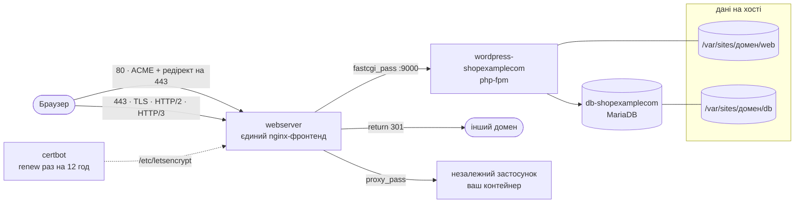
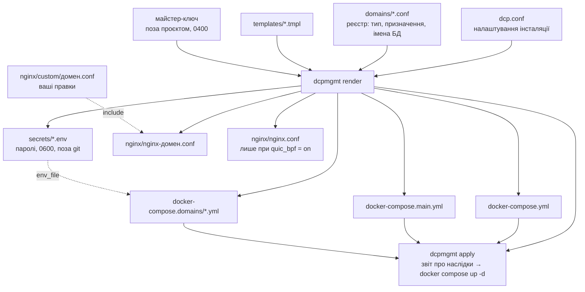

# Docker Web Stack

Мультидоменний web-стек на Docker: **один** nginx-фронтенд (TLS, HTTP/2,
HTTP/3) перед довільною кількістю незалежних доменів, плюс автоматичні
сертифікати Let's Encrypt.

Мета проєкту — **мінімум ручного втручання**. Додавання домену має бути
однією командою, а не проходженням чеклиста з дванадцяти пунктів, у якому
кожен пункт має власні граблі.

```
dcpmgmt add wordpress example.com
# → каталоги, БД, контейнери, сертифікат, nginx-конфіг, перезавантаження
# → лишилось зайти на https://example.com/wp-admin/install.php
```

## Три типи доменів

| Тип | Що це | Що піднімається |
|-----|-------|-----------------|
| `wordpress` | повноцінний сайт | `wordpress-*` (php-fpm) + `db-*` (MariaDB) |
| `redirect` | 301 на інший домен | нічого — віддає сам nginx |
| `proxy` | фронт до незалежного застосунку | ваш контейнер, описаний вами |

Спільних на весь стек сервісів рівно два: `webserver` (nginx) і `certbot`.



Redirect-домен не має власного контейнера: nginx віддає `301` сам.
Proxy-домен має контейнер, але описуєте його ви.

## Непорушне правило

**На кожен домен — своя структура.** Окремий `server`-блок, окремий
сертифікат, окремий каталог. Не об'єднувати домени в один vhost: сертифікати
Let's Encrypt не підтримують wildcard, а спільний vhost перетворює будь-яку
помилку на аварію всіх сайтів одразу.

---

## Як це влаштовано

Джерело істини — **реєстр** `domains/*.conf` і налаштування `dcp.conf`.
Усе інше з них генерується:



```
dcp.conf                      налаштування інсталяції (поза git)
domains/<домен>.conf          реєстр: тип, призначення, імена БД
secrets/<домен>.env           паролі БД, 0600, ЗАВЖДИ поза git
templates/*.tmpl              шаблони, з яких усе генерується
dcpmgmt                       інструмент
tools/backup.sh               бекап
   │
   ├─→ docker-compose.yml            (генерується повністю)
   ├─→ docker-compose.main.yml       (генерується повністю)
   ├─→ docker-compose.domains/*.yml  (генерується; proxy-файли — ваші)
   ├─→ nginx/nginx-<домен>.conf      (генерується; ваші правки — в custom/)
   ├─→ nginx/nginx.conf              (лише якщо quic_bpf = on)
   └─→ secrets/<домен>.env           (пароль БД, 0600)

/var/sites/<домен>/web        файли сайту
/var/sites/<домен>/db         база даних
/var/sites/letsencrypt/       сертифікати
```

Хто чим володіє — це важливо:

* **`docker-compose.yml` і `docker-compose.main.yml`** належать інструменту
  й перезаписуються щоразу. Правити їх руками немає сенсу.
* **`nginx/nginx-<домен>.conf`** генерується, але без `--force` не
  перезаписується. Правки, які мають пережити регенерацію, кладіть у
  `nginx/custom/<домен>.conf` (рівень `server`) і
  `nginx/custom/<домен>.php.conf` (усередині `location ~ \.php$`) — ці
  файли не перезаписуються ніколи.
* **`docker-compose.domains/<домен>.yml` для `proxy`** — ваш. Інструмент
  створює каркас один раз і більше його не чіпає навіть із `--force`.

### Чому саме так

`docker-compose.main.yml` **генерується цілком**, а не патчиться. Попередня
версія вставляла рядки в `depends_on`/`volumes` через `sed` «перед першим
рядком, що…» — це працює рівно доти, доки структуру файла не поправили
руками. Повна регенерація з реєстру не може вставити рядок не туди.

Сертифікати обслуговує **один** контейнер `certbot` замість одного на домен.
Двадцять сплячих контейнерів, кожен зі своїм 12-годинним циклом, не давали
нічого, крім двадцяти сплячих контейнерів.

`webserver` раз на 6 годин робить `nginx -s reload`. Без цього подовжений
сертифікат лежить на диску оновленим, а nginx продовжує віддавати клієнтам
старий із пам'яті — до найближчого перезапуску контейнера.

---

## Старт з нуля

```bash
git clone <репозиторій> && cd docker-web-stack
cp dcp.conf.example dcp.conf
$EDITOR dcp.conf          # certbot_email і project — обов'язково
sudo ./dcpmgmt init
sudo ./dcpmgmt add wordpress example.com
```

Про `project` у `dcp.conf`: це ім'я compose-проєкту, від якого залежить
префікс імен docker volume'ів (`<project>_db-examplecom`). На новій
інсталяції — будь-яке. На вже працюючій — **тільки те, з яким стек
працював досі**, інакше compose створить нові порожні volume'и замість
наявних. `dcpmgmt doctor` це перевіряє.

## Успадкована інсталяція

Якщо стек уже працює, а реєстру ще немає — нічого не ламаємо:

```bash
cp dcp.conf.example dcp.conf && $EDITOR dcp.conf
sudo ./dcpmgmt import        # зібрати реєстр із наявних конфігів
sudo ./dcpmgmt doctor        # звірити реєстр із реальністю
sudo ./dcpmgmt render --diff # подивитись, чим згенероване відрізняється
sudo ./dcpmgmt apply         # застосувати — покаже наслідки ДО того, як діяти
```

`import` читає `nginx/nginx-*.conf` і `docker-compose.domains/*.yml`,
визначає тип кожного домену, переносить наявні паролі БД у `secrets/`
(ті самі — БД чіпати не треба) і зберігає наявні імена БД і користувачів
як є, навіть якщо вони не збігаються зі схемою іменування.

### Що саме зробить apply

`apply` **не робить `docker compose down`**. Він виконує
`docker compose up -d --remove-orphans` — операцію інкрементальну:
compose порівнює хеш конфігурації кожного сервісу з тим, що записано на
працюючому контейнері, і чіпає лише ті, де хеш змінився. Решта навіть не
зупиняється. Дані, томи й сертифікати не чіпаються взагалі.

Обсяг залежить від `--force`, і різниця велика. Без нього перезаписуються
лише два зведені compose-файли, бо вони належать інструменту; наявні
доменні yml і nginx-конфіги лишаються як є:

```
  ПЕРЕСТВОРИТИ  webserver
  СТВОРИТИ      certbot
  без змін:     26 із 27
```

З `--force` доходить і до доменних файлів: перестворюються `db-*` і
`wordpress-*`, прибираються контейнери, які більше не потрібні —
`redirect-*` пустушки й `certbot-*` по домену.

Тому переходити краще не одним стрибком:

```bash
dcpmgmt apply                                   # 1. фронтенд і спільний certbot
                                                # 2. переконатись, що все живе
dcpmgmt render --force example.com && dcpmgmt apply   # 3. по одному сайту
```

Між кроками 1 і 3 старі `certbot-*` контейнери крутяться поруч зі
спільним `certbot` і конкурують за lock у `/etc/letsencrypt`: один
відпрацює, інший скаже `Another instance of Certbot is already running`
і спробує за 12 годин. Шум у логах, не поломка; зникає на кроці 3.

Дві речі, які варто знати про крок 3:

* перестворений `wordpress-*` отримує нову адресу в мережі docker, а
  nginx резолвить `fastcgi_pass` один раз при завантаженні конфігурації
  і тримає стару — сайт віддає 502. Саме тому `apply` завершується
  `nginx -t && nginx -s reload`: перезавантаження резолвить імена наново.
  Вікно з 502 — кілька секунд;
* `wordpress-*` чекає, поки `db-*` стане `healthy` (`start_period` 30 с),
  тож перестворення сайту займає до півхвилини. На кроці 1 цього немає:
  бази не чіпаються.

---

## Щоденні операції

```bash
dcpmgmt add wordpress shop.example.com            # + --image wordpress:X
dcpmgmt add redirect  example.net --to example.com
dcpmgmt add proxy     api.example.com --upstream my-app:8080
dcpmgmt remove old.example.com                    # + --purge (разом із даними)

dcpmgmt list                                      # що є в реєстрі
dcpmgmt doctor                                    # перевірити все
dcpmgmt render --diff                             # що розійшлось із реєстром
dcpmgmt apply                                     # застосувати зміни
dcpmgmt cert issue|renew|list <домен>             # сертифікати вручну
```

Перед `add` домен має вже вказувати сюди A/AAAA-записом, інакше
Let's Encrypt не пройде валідацію. Якщо DNS ще не готовий —
`--no-cert`, домен підніметься із заглушкою на :80, а сертифікат
отримаєте потім через `cert issue`.

Все, що стосується БД — ім'я, користувач, пароль, хост — генерується
детерміновано з імені домену. Нічого не питається й нічого не треба
вигадувати: `shop.example.com` → БД `shopexamplecom`, користувач
`ushopexamplecom`, хост `db-shopexamplecom`, пароль на 48 символів
у `secrets/shop.example.com.env`.

### Redirect-домени

nginx віддає `301`, але в `web/` додатково кладеться `index.html` з
`<meta refresh>` — підстраховка на випадок, коли 443-блок тимчасово
вимкнено (наприклад, поки немає сертифіката). Контейнера для редіректу
не створюється взагалі.

### Proxy-домени

Інструмент бере на себе тільки nginx і сертифікат. Сервіс застосунку
описуєте ви в `docker-compose.domains/<домен>.yml`; поки там лишається
`CHANGE-ME`, файл навмисно не включається в стек, щоб `docker compose up`
не спіткнувся об неіснуючий образ. Ім'я хоста в `--upstream` має
збігатися з іменем сервісу або `container_name`, і сервіс має бути в
мережі `app-network`.

---

## Сертифікати

**Первинна видача** — одноразовий контейнер `certbot certonly --webroot`.
Не `docker exec` у `certbot`: той сидить у циклі `renew` і тримає lock,
`exec` впаде з `Another instance of Certbot is already running`.

**Подовження** — спільний контейнер `certbot` у циклі `certbot renew`
кожні 12 годин, `webserver` підхоплює оновлене раз на 6 годин.

Згенерований nginx-конфіг **ніколи не посилається на відсутній
сертифікат**: поки сертифіката немає, домен отримує конфіг лише з :80.
Це принципово — `ssl_certificate` на неіснуючий файл валить увесь nginx,
а він один на всі домени, тобто падають усі сайти, а не тільки новий.

Ліміти Let's Encrypt (5 невдалих валідацій на годину, 50 сертифікатів на
домен на тиждень) не обходяться повторними спробами. Для перевірки схеми
без витрати лімітів — `dcpmgmt cert issue <домен> --staging`.

---

## Паролі БД

Ідентифікатори БД виводяться з домену детерміновано, і пароль — теж.
Типовий режим (`password_mode = derived` у `dcp.conf`):

```
пароль = HMAC-SHA512(майстер-ключ, домен) → base64 без +/= → 48 символів
```

Майстер-ключ створюється сам при першій потребі (48 випадкових байтів,
права `0400`) і більше не змінюється. Лежить **поза проєктом**
(`~/.dcp-master-key`) — усередині `secrets/` він загинув би разом із тим,
що має відновлювати.

Сенс не в тому, щоб не зберігати паролі, а в тому, **що саме зберігати**.
Копія одного ключа в менеджері паролів замінює бекап усього каталогу
`secrets/`:

```bash
dcpmgmt secrets restore            # відновити всі втрачені secrets/*.env
dcpmgmt secrets show example.com   # подивитись пароль домену
dcpmgmt secrets key                # де лежить ключ і які в нього права
```

Той самий алгоритм доступний окремо — `tools/mkpass` працює і поза
проєктом, з тим самим ключем і тим самим результатом:

```bash
$ dcpmgmt secrets show example.com
prcDH6wjEcth81c313hf8RoKoR2QJIEBnFZbtbdHrqHIslyR
$ tools/mkpass example.com
prcDH6wjEcth81c313hf8RoKoR2QJIEBnFZbtbdHrqHIslyR
```

Альтернатива — `password_mode = random`: 48 випадкових символів на домен,
нізвідки не відновлюються. Успадковані при `import` домени завжди
позначаються як `random`: їхній пароль узято з працюючої БД, а не виведено
з ключа.

Режим записується в реєстр домену при створенні, тож зміна `password_mode`
не стосується вже створених сайтів. Наявні `secrets/*.env` не чіпаються
ніколи.

**Чого dcpmgmt не зробить:** не вигадає новий пароль для домену, чия база
вже ініціалізована. MariaDB читає `MYSQL_PASSWORD` лише при першому старті
на порожньому каталозі, тож новий пароль вона просто не прийме — а сайт
ляже з помилкою автентифікації при цілому на вигляд `secrets/`. У режимі
`derived` питання не виникає (виводиться той самий пароль), у `random`
інструмент зупиниться і скаже, що робити.

## HTTP/3 і QUIC

HTTP/3 вмикається по-доменно (`http3` у реєстрі, типово `on`). Дві речі
на рівні всього стека:

**`reuseport`** має стояти рівно в одному vhost — це вказується в
`dcp.conf` (`quic_reuseport_domain`). Дублікат валить nginx із
`duplicate listen options`, причому вказує на чужий файл. `doctor`
стежить, щоб такий був один.

**`quic_bpf`** — окрема історія. Це директива **головного** контексту:
покласти її в `conf.d/` не можна, бо той інклюдиться всередині `http{}`.
Тому при `quic_bpf = on` dcpmgmt генерує власний `nginx/nginx.conf` і
монтує його як `/etc/nginx/nginx.conf`.

Навіщо вона: з кількома воркерами і `reuseport` пакети QUIC-з'єднання
після зміни IP клієнта (міграція з'єднання — Wi-Fi → LTE) можуть
прилетіти не тому воркеру, що тримає стан з'єднання. eBPF-маршрутизація
це виправляє.

Ціна: nginx вантажить eBPF-програму зсередини контейнера, тож webserver
отримує `CAP_BPF`, `CAP_NET_ADMIN` і `seccomp:unconfined` — типовий
профіль seccomp у docker блокує виклик `bpf()` усім, крім `CAP_SYS_ADMIN`.
Це той самий контейнер, що дивиться в інтернет.

**Вмикати варто свідомо.** Якщо ядро чи docker не дадуть `bpf()`, nginx
може не піднятись, а він один на всі домени. Порядок такий:

```bash
$EDITOR dcp.conf        # quic_bpf = on
dcpmgmt apply
docker logs webserver   # одразу, не відкладаючи
```

Відкат — `quic_bpf = off` і `dcpmgmt apply`.

**Типове значення `off` — і для звичайного сайту цього досить.** Без
`quic_bpf` ламається рівно одне: міграція QUIC-з'єднання при зміні IP
клієнта (Wi-Fi → LTE). Пакет прилітає воркеру, який не має стану
з'єднання, клієнт отримує stateless reset і переустановлює з'єднання —
на сайті це непомітно. Міняти заради цього профіль seccomp
інтернет-фронтенду сенсу мало.

Дешевша альтернатива без жодних привілеїв: `worker_processes = 1`.
Воркер один — маршрутизувати між воркерами нема чого, міграція QUIC
працює сама. Для фронтенда, який віддає статику й проксіює на php-fpm,
одного воркера вистачає надовго.

## Бекап

```bash
tools/backup.sh          # BAK/0 — свіжий, BAK/9 — найстаріший
```

Дампи БД, архіви `web/`, конфігурація стека. **`secrets/` навмисно не
потрапляє в бекап.** У режимі `derived` його й не треба бекапити — досить
копії майстер-ключа (див. «Паролі БД»); у режимі `random` зберігайте
`secrets/` окремо, без нього дампи відновити можна, а контейнери підняти ні.

Відкат конфігурації: `git checkout -- .` і `dcpmgmt apply`. Кожен
перезаписаний файл додатково лишає поруч `.bak`.

---

## Публікація репозиторію

Проєкт розділено так, щоб приватну інсталяцію можна було відкрити в
паблік без вичищання історії:

* **інструмент** — `dcpmgmt`, `templates/`, `tools/`, `dcp.conf.example`,
  документація. Жодного домену, e-mail чи пароля тут не зашито;
* **інсталяція** — `dcp.conf`, `domains/`, `secrets/`, `nginx/`,
  `docker-compose*.yml`. Це ваш сервер, і в `.gitignore` воно вже є.

`secrets/` не потрапляє в git ніколи. Решта стану за замовчуванням теж
ігнорується; якщо для приватного репозиторію хочеться тримати стан під
версійним контролем заради відкату — приберіть відповідні рядки з
`.gitignore`, але тоді перед публікацією їх доведеться викорінювати з
історії (`git filter-repo`).

---

## Версії

`dcpmgmt version` показує версію інструмента. Кожна зміна коду
супроводжується підняттям версії і записом у
[CHANGELOG.md](CHANGELOG.md) — там видно, що саме змінилось між
випусками й чи потрібні ручні дії при оновленні.

## Документація

* [CHANGELOG.md](CHANGELOG.md) — що змінювалось.
* [docs/troubleshooting.md](docs/troubleshooting.md) — граблі, зібрані на
  бойовому сервері, і що робити, коли щось не так.
* [docs/wordpress-migration.md](docs/wordpress-migration.md) — перенесення
  готового сайту з чернетки на постійний домен.

## Вимоги

Docker з плагіном `compose` v2, perl (є в базовій Debian), `openssl` для
`dcpmgmt list` і `doctor`. Команди, що чіпають `/var/sites`, потребують root.

## Ліцензія

GPL-2.0 (див. [LICENSE](LICENSE)).
