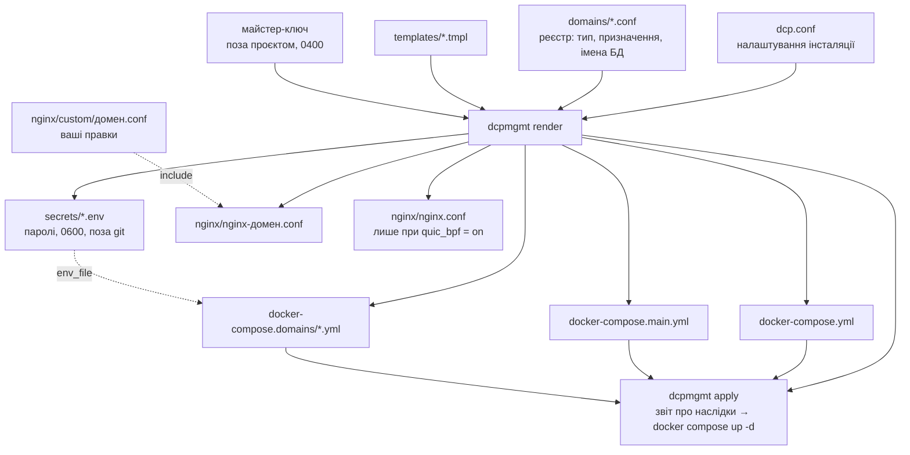

# Docker Web Stack

Мультидоменний web-стек на Docker: **один** nginx-фронтенд (TLS, HTTP/2,
HTTP/3) перед довільною кількістю незалежних доменів, плюс автоматичні
сертифікати Let's Encrypt.

Мета проєкту — **мінімум ручного втручання**. Додавання домену має бути
однією командою, а не проходженням чеклиста з дванадцяти пунктів, у якому
кожен пункт має власні граблі.

```
dcpmgmt add wordpress example.com
# → каталоги, БД, контейнери, сертифікат, nginx-конфіг, перезавантаження
# → лишилось зайти на https://example.com/wp-admin/install.php
```

## Три типи доменів

| Тип | Що це | Що піднімається |
|-----|-------|-----------------|
| `wordpress` | повноцінний сайт | `wordpress-*` (php-fpm) + `db-*` (MariaDB) |
| `redirect` | 301 на інший домен | нічого — віддає сам nginx |
| `proxy` | фронт до незалежного застосунку | ваш контейнер, описаний вами |

Спільних на весь стек сервісів рівно два: `webserver` (nginx) і `certbot`.


Redirect-домен не має власного контейнера: nginx віддає `301` сам.
Proxy-домен має контейнер, але описуєте його ви.

## Непорушне правило

**На кожен домен — своя структура.** Окремий `server`-блок, окремий
сертифікат, окремий каталог. Не об'єднувати домени в один vhost: сертифікати
Let's Encrypt не підтримують wildcard, а спільний vhost перетворює будь-яку
помилку на аварію всіх сайтів одразу.

---

## Як це влаштовано

Джерело істини — **реєстр** `domains/*.conf` і налаштування `dcp.conf`.
Усе інше з них генерується:



Хто чим володіє — це найважливіше, що варто винести з цього розділу.

**У каталозі інсталяції:**

| Шлях | Що це | Чиє |
|---|---|---|
| `dcp.conf` | налаштування інсталяції | ваше, поза git |
| `domains/<домен>.conf` | реєстр: тип, призначення, імена БД | ваше — джерело істини |
| `nginx/custom/<домен>.conf`<br/>`nginx/custom/<домен>.php.conf` | правки nginx на рівні `server` і всередині `location ~ \.php$` | ваше — не чіпається **ніколи**, навіть із `--force` |
| `docker-compose.domains/<домен>.yml` типу `proxy` | сервіси проксійованого застосунку | ваше — каркас створюється один раз і більше не чіпається |
| `templates/*.tmpl`, `dcpmgmt`, `tools/` | шаблони та сам інструмент | інструмента |
| `docker-compose.yml`<br/>`docker-compose.main.yml` | кістяк стека | генерується **цілком і щоразу** — правити немає сенсу |
| `docker-compose.domains/<домен>.yml` типу `wordpress` | php-fpm і БД домену | генерується; `--force` перезапише |
| `nginx/nginx-<домен>.conf` | vhost домену | генерується; без `--force` не перезаписується |
| `nginx/nginx.conf` | головний конфіг nginx | генерується лише при `quic_bpf = on` |
| `secrets/<домен>.env` | пароль БД, 0600 | генерується, **завжди** поза git |

**На хості:**

| Шлях | Що це | Чиє |
|---|---|---|
| `/var/sites/<домен>/web` | файли сайту | WordPress оновлює себе сам |
| `/var/sites/<домен>/db` | datadir бази | СУБД; руками не чіпати |
| `/var/sites/<домен>/php/*.ini` | налаштування PHP | ваше — монтується в `conf.d` контейнера |
| `/var/sites/letsencrypt/` | сертифікати й renewal-конфіги | certbot |

Що з чого генерується — на діаграмі вище. Два правила, які варто
запам'ятати замість таблиці: **усе, що згенероване, можна безпечно
втратити** — воно відновлюється з реєстру; **усе, що ваше, інструмент не
переписує** — для nginx це `custom/`, для PHP це `php/*.ini`, для
проксі це його власний yml.

### Чому саме так

`docker-compose.main.yml` **генерується цілком**, а не патчиться. Попередня
версія вставляла рядки в `depends_on`/`volumes` через `sed` «перед першим
рядком, що…» — це працює рівно доти, доки структуру файла не поправили
руками. Повна регенерація з реєстру не може вставити рядок не туди.

Сертифікати обслуговує **один** контейнер `certbot` замість одного на домен.
Двадцять сплячих контейнерів, кожен зі своїм 12-годинним циклом, не давали
нічого, крім двадцяти сплячих контейнерів.

`webserver` раз на 6 годин робить `nginx -s reload`. Без цього подовжений
сертифікат лежить на диску оновленим, а nginx продовжує віддавати клієнтам
старий із пам'яті — до найближчого перезапуску контейнера.

---

## Старт з нуля

```bash
git clone <репозиторій> && cd docker-web-stack
cp dcp.conf.example dcp.conf
$EDITOR dcp.conf          # certbot_email і project — обов'язково
sudo ./dcpmgmt init
sudo ./dcpmgmt add wordpress example.com
```

Про `project` у `dcp.conf`: це ім'я compose-проєкту, від якого залежить
префікс імен docker volume'ів (`<project>_db-examplecom`). На новій
інсталяції — будь-яке. На вже працюючій — **тільки те, з яким стек
працював досі**, інакше compose створить нові порожні volume'и замість
наявних. `dcpmgmt doctor` це перевіряє.

## Успадкована інсталяція

Якщо стек уже працює, а реєстру ще немає — нічого не ламаємо:

```bash
cp dcp.conf.example dcp.conf && $EDITOR dcp.conf
sudo ./dcpmgmt import        # зібрати реєстр із наявних конфігів
sudo ./dcpmgmt doctor        # звірити реєстр із реальністю
sudo ./dcpmgmt render --diff # подивитись, чим згенероване відрізняється
sudo ./dcpmgmt apply         # застосувати — покаже наслідки ДО того, як діяти
```

`import` читає `nginx/nginx-*.conf` і `docker-compose.domains/*.yml`,
визначає тип кожного домену, переносить наявні паролі БД у `secrets/`
(ті самі — БД чіпати не треба) і зберігає наявні імена БД і користувачів
як є, навіть якщо вони не збігаються зі схемою іменування.

### Що зникає, а що лише переїжджає

Для кожного nginx-конфіга `render --diff` окремо звіряє **набір директив**,
без огляду на порядок і форматування, і каже прямо: «жодної директиви не
втрачено» або перелічує ті, що зникають.

Текстовий diff на це питання не відповідає. Директива, яка переїхала на
двадцять рядків нижче в межах того самого блоку, виглядає в ньому
видаленою — а в тисячі рядків різниці перевірити це оком неможливо.

### Що саме зробить apply

`apply` **не робить `docker compose down`**. Він виконує
`docker compose up -d --remove-orphans` — операцію інкрементальну:
compose порівнює хеш конфігурації кожного сервісу з тим, що записано на
працюючому контейнері, і чіпає лише ті, де хеш змінився. Решта навіть не
зупиняється. Дані, томи й сертифікати не чіпаються взагалі.

Звіт перед підтвердженням будується так само: бажаний стан звіряється з
міткою `com.docker.compose.config-hash` на кожному наявному контейнері,
тобто саме з тим, за чим вирішує сам docker. Тому звіт не залежить від
того, чи згенерували файли щойно, чи ще вчора.

Обсяг залежить від `--force`, і різниця велика. Без нього перезаписуються
лише два зведені compose-файли, бо вони належать інструменту; наявні
доменні yml і nginx-конфіги лишаються як є:

```
  ПЕРЕСТВОРИТИ  webserver
  СТВОРИТИ      certbot
  без змін:     26 із 27
```

З `--force` доходить і до доменних файлів: перестворюються `db-*` і
`wordpress-*`, прибираються контейнери, які більше не потрібні —
`redirect-*` пустушки й `certbot-*` по домену.

Тому переходити краще не одним стрибком:

```bash
dcpmgmt apply                                   # 1. фронтенд і спільний certbot
                                                # 2. переконатись, що все живе
dcpmgmt render --force example.com && dcpmgmt apply   # 3. по одному сайту
```

Між кроками 1 і 3 старі `certbot-*` контейнери крутяться поруч зі
спільним `certbot` і конкурують за lock у `/etc/letsencrypt`: один
відпрацює, інший скаже `Another instance of Certbot is already running`
і спробує за 12 годин. Шум у логах, не поломка; зникає на кроці 3.

Перед тим як чіпати робочий `webserver`, `apply` перевіряє згенеровану
конфігурацію в одноразовому контейнері nginx — тим самим образом і тими
самими монтами. Зламаний конфіг не доходить до працюючого фронтенду:
той далі крутиться зі старою конфігурацією в пам'яті, і сайти живі.

Дві речі, які варто знати про крок 3:

* перестворений `wordpress-*` отримує нову адресу в мережі docker, а
  nginx резолвить `fastcgi_pass` один раз при завантаженні конфігурації
  і тримає стару — сайт віддає 502. Саме тому `apply` завершується
  `nginx -t && nginx -s reload`: перезавантаження резолвить імена наново.
  Вікно з 502 — кілька секунд;
* `wordpress-*` чекає, поки `db-*` стане `healthy` (`start_period` 30 с),
  тож перестворення сайту займає до півхвилини. На кроці 1 цього немає:
  бази не чіпаються.

---

## Щоденні операції

```bash
dcpmgmt add wordpress shop.example.com            # + --image wordpress:X
dcpmgmt add redirect  example.net --to example.com
dcpmgmt add proxy     api.example.com --upstream my-app:8080
dcpmgmt remove old.example.com                    # + --purge (разом із даними)

dcpmgmt list                                      # що є в реєстрі
dcpmgmt doctor                                    # перевірити все
dcpmgmt render --diff                             # що розійшлось із реєстром
dcpmgmt apply                                     # застосувати зміни
dcpmgmt cert issue|renew|list <домен>             # сертифікати вручну
```

Команди, що змінюють працюючий стек, питають підтвердження: `так` або
`ні`. Для неінтерактивного запуску — глобальний ключ `--yes`.

Перед `add` домен має вже вказувати сюди A/AAAA-записом, інакше
Let's Encrypt не пройде валідацію. Якщо DNS ще не готовий —
`--no-cert`, домен підніметься із заглушкою на :80, а сертифікат
отримаєте потім через `cert issue`.

Все, що стосується БД — ім'я, користувач, пароль, хост — генерується
детерміновано з імені домену. Нічого не питається й нічого не треба
вигадувати: `shop.example.com` → БД `shopexamplecom`, користувач
`ushopexamplecom`, хост `db-shopexamplecom`, пароль на 48 символів
у `secrets/shop.example.com.env`.

### Redirect-домени

`:80` веде одразу на ціль, `:443` — теж (`301`). Проміжного стрибка через
`https://<себе>` немає навмисно: редіректу не потрібен власний сертифікат,
щоб виконати редірект, інакше протермінований сертифікат перетворював би
робочий редірект на сторінку помилки браузера.

У `web/` додатково кладеться `index.html` з `<meta refresh>` — підстраховка
на випадок, коли 443-блок тимчасово вимкнено. Контейнера для редіректу не
створюється взагалі.

### Версія WordPress і тег образу

WordPress оновлює себе сам, тож у `web/` з часом опиняється версія новіша
за тег образу. Робочому сайту це не заважає: офіційний entrypoint копіює
ядро лише коли в каталозі немає ні `index.php`, ні
`wp-includes/version.php`, а `wp-config.php` створює лише коли його немає
або він порожній. Наявний сайт не перезаписується ніколи.

Тег важить в одному випадку: якщо `web/` колись відновлять порожнім,
розгорнеться саме версія з тега. `doctor` показує розбіжність, щоб вона
не спливла в найгірший момент.

### Образ бази даних

Типово `db_image` береться з `dcp.conf` (`mariadb:latest`), але його можна
задати для окремого домену:

```
db_image    = mysql:8.0
```

Це знадобиться при переїзді успадкованого сайту, який крутився на MySQL:
MariaDB не відкриває чужий datadir і падає з `Unsupported redo log
format` — двигуни розійшлися на рівні файлів, і жодні паролі тут ні до
чого. Тримати сайт на MySQL — спосіб підняти його як є; перевести на
MariaDB можна окремо, через `mysqldump` і заливку дампа у свіжу базу
(у дампі з MySQL 8 доведеться замінити колацію `utf8mb4_0900_ai_ci`,
якої MariaDB не знає).

Клієнт для healthcheck вибирається за образом сам: `mysqladmin` для
MySQL, `mariadb-admin` для MariaDB. Переплутати їх означає отримати
контейнер, який вічно `unhealthy`, і WordPress, який через
`depends_on: service_healthy` не стартує зовсім.

### Налаштування PHP

Усе, що лежить у `<sites_root>/<домен>/php/*.ini`, монтується в
`/usr/local/etc/php/conf.d/` контейнера:

```
/var/sites/example.com/php/maxsize.ini
```

```ini
max_execution_time = 120
post_max_size = 21M
upload_max_filesize = 20M
```

Реєстр про ці файли нічого не знає — як і про `nginx/custom/<домен>.conf`.
Правка живе поруч із сайтом і переживає `render --force`.

Монтуються окремі файли, а не каталог: інакше монт сховав би те, що
поклав у `conf.d` сам образ (`opcache-recommended.ini`,
`error-logging.ini`). PHP читає каталог за абеткою, тож файл, який має
**перекрити** налаштування образу, називайте так, щоб він сортувався
пізніше — наприклад `zz-limits.ini`.

Перевіряти результат через `docker exec … php -i` не можна: це запускає
CLI SAPI, а він, наприклад, завжди повідомляє `max_execution_time = 0`,
хоч би що стояло в ini. Значення, які реально бачить php-fpm, дивіться
по HTTP — у WordPress це «Інструменти → Стан сайту → Інформація».

Після додавання нового `.ini` потрібні `render --force` і `apply`:
монтування — це частина опису контейнера, тож контейнер перестворюється.
`doctor` нагадає, якщо файл лежить, а в yml його ще немає.

### Додаткові змінні оточення

Якщо WordPress-контейнеру потрібна змінна, якої немає в схемі, — вона
живе в реєстрі домену:

```
extra_env   = PHP_DISPLAY_ERRORS=On, WORDPRESS_DEBUG=1
```

`import` підхоплює такі змінні з наявного yml сам. Якщо в yml знайдеться
змінна, якої немає ні в схемі, ні в `extra_env`, `render` скаже про це
до того, як її зітре.

### Proxy-домени

Інструмент бере на себе тільки nginx і сертифікат. Сертифікат при цьому
нікуди не дівається: per-домен `certbot-*` контейнери зникають тому, що
подовженням усіх сертифікатів займається один спільний сервіс `certbot`,
який монтує webroot кожного домену. Файл домену інструмент не чіпає ні
при `render`, ні з `--force`. Сервіс застосунку описуєте ви в
`docker-compose.domains/<домен>.yml`; поки там лишається
`CHANGE-ME`, файл навмисно не включається в стек, щоб `docker compose up`
не спіткнувся об неіснуючий образ. Ім'я хоста в `--upstream` має
збігатися з іменем сервісу або `container_name`, і сервіс має бути в
мережі `app-network`.

---

## Довідник команд

Усі команди запускаються з кореня інсталяції. Ті, що чіпають `/var/sites`
або docker, потребують root. Глобальний ключ `--yes` пропускає всі
підтвердження — для cron і скриптів.

| Команда | Що робить | root |
|---|---|---|
| [`init`](#init--структура-проєкту-з-нуля) | Створює каталоги реєстру, секретів і хостові шляхи, генерує порожній кістяк compose. Одноразово, на порожньому місці. | так |
| [`import`](#import---from-dir--успадкувати-те-що-вже-працює) | Збирає реєстр із наявних `docker-compose*.yml` і `nginx/*.conf`, нічого не ламаючи. Для стека, який уже працює. | так |
| [`add`](#add-wordpressredirectproxy-домен--новий-домен-однією-командою) | Новий домен від запису в реєстрі до виданого сертифіката: файли → стек → cert → бойовий vhost. | так |
| [`remove`](#remove-домен---purge--прибрати-домен) | Викидає домен зі стека. Без `--purge` дані, БД і сертифікат лишаються недоторканими. | так |
| [`list`](#list---type-тип---names--що-є-в-реєстрі) | Таблиця: домен, тип, призначення, HTTP/3, стан сертифіката. `--names` — плаский список для скриптів. | ні |
| [`doctor`](#doctor--перевірити-все) | Перевіряє узгодженість усього: сертифікати, renewal, nginx, паролі, права, секрети в git, `docker compose config`. | так |
| [`render`](#render---diff---force-домен--перегенерувати-файли) | Перегенеровує файли з реєстру. `--diff` показує різницю і що зникне, `--force` перезаписує. Стека не чіпає. | так |
| [`apply`](#apply---force--застосувати-до-працюючого-стека) | Показує, що станеться з контейнерами, і після підтвердження застосовує: `up -d` + перевірка конфігу + reload nginx. | так |
| [`cert`](#cert-issuerenewlist-домен---staging---force---dry-run) | Видача, подовження і перегляд сертифікатів. `--staging` і `--dry-run` — щоб не палити ліміти Let's Encrypt. | так |
| [`secrets`](#secrets-showrestorekey--паролі-бд) | Показати пароль домену, відновити `secrets/` з майстер-ключа, показати сам ключ. | так |
| [`version`](#version--версія-інструмента) | Версія інструмента — те, що варто вказати в баг-репорті. | ні |

Нижче — кожна команда докладно: що робить, як робить і навіщо саме так.

---

### `init` — структура проєкту з нуля

**Що.** Створює все, що решта інструмента вважає наявним: каталоги
реєстру, секретів, шаблонних гаків, а на хості — `sites_root`,
`nginx_conf_dir` і `letsencrypt/{etc,var}`. Наприкінці генерує порожні
`docker-compose.yml` і `docker-compose.main.yml`.

**Як.** Якщо `dcp.conf` ще немає — копіює його з `dcp.conf.example`,
каже виправити й зупиняється. На другому запуску, коли конфіг заповнено,
робить решту. `secrets/` отримує права `0700`.

**Навіщо два кроки.** `certbot_email` і `project` вгадати неможливо, а
помилка в `project` коштує дорого: це ім'я формує префікс імен docker
volume'ів, і неправильне значення змусить compose створити нові порожні
томи замість наявних.

---

### `import [--from DIR]` — успадкувати те, що вже працює

**Що.** Будує реєстр `domains/*.conf` з наявної інсталяції. Більше не
робить **нічого**: ні файлів не переписує, ні контейнерів не чіпає.

**Як.** Читає `nginx/nginx-*.conf` і визначає тип домену за тим, що в
ньому є: `fastcgi_pass … :9000` → wordpress, `proxy_pass` → proxy,
інакше redirect із ціллю з `return 30x`. Звідти ж бере `http3` і
`reuseport`. З `docker-compose.domains/*.yml` дістає образ, імена БД,
пароль (переносить у `secrets/<домен>.env`) і нестандартні змінні
оточення (в `extra_env`).

**Навіщо так обережно.** Успадкований пароль узято з живої БД, а не
виведено з ключа, тому домен позначається `password_mode = random` —
інакше `secrets restore` колись підсунув би базі пароль, якого вона не
знає. Коментарі з конфігів вирізаються перед розбором: закоментований
`reuseport` — це не конфігурація.

---

### `add wordpress|redirect|proxy <домен>` — новий домен однією командою

**Що.** Доводить домен від нічого до робочого HTTPS: запис у реєстрі,
каталоги, БД із паролем, сертифікат, nginx-конфіг, перезавантаження.

**Як.** Чотири кроки. Спершу генеруються файли, причому nginx отримує
конфіг **тільки з `:80`** і локацією для acme-challenge. Далі
`docker compose up -d` піднімає контейнери домену. Потім одноразовий
контейнер `certbot certonly --webroot` отримує сертифікат. І лише тоді
пишеться бойовий конфіг із `:443` і виконується `nginx -s reload`.

**Навіщо заглушка на `:80`.** `ssl_certificate`, що вказує на ще не
виданий файл, валить **увесь** nginx, а він один на всі домени. Тобто
помилка в новому сайті поклала б усі наявні. Згенерований конфіг ніколи
не посилається на відсутній сертифікат.

**Навіщо одноразовий certbot.** Постійний контейнер сидить у циклі
`certbot renew` і тримає lock у `/etc/letsencrypt` — `exec` у нього
впаде з `Another instance of Certbot is already running`.

**Ключі.** `--image` — інший образ WordPress; має бути fpm-варіантом,
бо nginx ходить у WordPress через `fastcgi_pass :9000`, а `wordpress:latest`
— це апачевий образ і дасть 502. `--no-http3` — без QUIC.
`--no-cert` — пропустити видачу (коли DNS ще не переведено); домен
підніметься із заглушкою, сертифікат візьмете потім через `cert issue`.
`--staging` — тестовий сервер Let's Encrypt, не витрачає лімітів.
`--to` — ціль для redirect, `--upstream` — `host:port` для proxy.

---

### `remove <домен> [--purge]` — прибрати домен

**Що.** Зупиняє й видаляє контейнери домену, прибирає його з реєстру та
згенерованих файлів, перегенеровує стек.

**Як.** Без `--purge` дані лишаються недоторканими: `/var/sites/<домен>`,
`secrets/<домен>.env` і сертифікат нікуди не діваються. З `--purge`
додатково виконується `certbot delete` і зноситься каталог домену разом
із базою.

**Навіщо розділено.** Прибрати домен зі стека й знищити його дані — різні
за наслідками дії. Перша скасовується за хвилину, друга не скасовується
взагалі.

---

### `list [--type ТИП] [--names]` — що є в реєстрі

**Що.** Таблиця: домен, тип, призначення, HTTP/3, стан сертифіката.

**Як.** `--type wordpress|redirect|proxy` фільтрує, `--names` друкує лише
імена по одному на рядок.

**Навіщо `--names`.** Щоб реєстр можна було згодувати іншим скриптам —
`tools/backup.sh` саме так і обходить домени.

---

### `doctor` — перевірити все

**Що.** Звіряє реєстр, файли на диску, стан docker і стан Let's Encrypt.
Повертає ненульовий код, якщо є помилки.

**Як.** Перевіряє, зокрема: збіг імені compose-проєкту з міткою на
працюючих контейнерах; наявність каталогів, конфігів і сертифікатів;
**термін дії сертифікатів** (протермінований — помилка, менше 14 днів —
попередження); `server_name` у конфізі проти самого домену; одне ім'я в
двох файлах; `authenticator` і `webroot_path` у renewal-конфігах;
працездатність спільного `certbot` і помилки в його свіжому логу;
успадковані per-домен certbot-сервіси; єдиність `reuseport`;
сторонні конфіги в `nginx_conf_dir`;
наявність `fastcgi_param HTTP_HOST $host` у vhost з `http3 = on`;
fpm-варіант образу WordPress;
узгодженість `quic_bpf`; права на секрети й майстер-ключ; паролі, що
потрапили в git; версію WordPress проти тега образу; `docker compose
config`.

**Навіщо стільки.** Кожна перевірка з'явилася після реальної поломки, а
не з уяви. Спільна риса всіх них — вони тихі: сайт працює, контейнер
`Up`, а щось уже зламано й виявиться за тижні.

---

### `render [--diff] [--force] [<домен>…]` — перегенерувати файли

**Що.** Будує з реєстру nginx-конфіги, файли доменів, `index.html`
редіректів і два зведені compose-файли. Контейнерів не чіпає.

**Як.** Діє правило власності. `docker-compose.yml` і
`docker-compose.main.yml` належать інструменту й перезаписуються завжди.
Решта — ні: наявний файл з іншим вмістом без `--force` лишається як є.
Файл proxy-домену не перезаписується **навіть із `--force`** — він ваш.
Файли `nginx/custom/*` не чіпаються ніколи.

**`--diff`** показує різницю і, окремо для кожного nginx-конфіга, звіряє
**набір директив**: «жодної директиви не втрачено» або перелік тих, що
зникають.

**Навіщо звірка директив.** Текстовий diff на головне питання не
відповідає: директива, що переїхала на двадцять рядків нижче, виглядає в
ньому видаленою. У тисячі рядків різниці це оком не перевірити.

---

### `apply [--force]` — застосувати до працюючого стека

**Що.** Перегенеровує файли, показує, що саме зробить із контейнерами,
питає підтвердження, перевіряє конфігурацію і застосовує.

**Як.** Бажаний стан звіряється з міткою `com.docker.compose.config-hash`
на наявних контейнерах — тобто рівно з тим, за чим вирішує сам docker.
Далі одноразовий контейнер nginx перевіряє згенеровану конфігурацію тими
самими монтами. І лише тоді `docker compose up -d --remove-orphans` та
`nginx -t && nginx -s reload`.

**Навіщо перевірка в окремому контейнері.** Зламаний конфіг не доходить
до працюючого фронтенду: той далі крутиться зі старою конфігурацією в
пам'яті, і сайти живі.

**Навіщо reload наприкінці.** Перестворений php-fpm контейнер отримує
нову адресу в мережі docker, а nginx резолвить `fastcgi_pass` один раз
при завантаженні конфігурації. Без reload сайт віддає 502.

**Це не `down`.** Compose чіпає лише сервіси, чий хеш змінився; решта
навіть не зупиняється. Дані, томи й сертифікати не чіпаються взагалі.

---

### `cert issue|renew|list [<домен>] [--staging] [--force] [--dry-run]`

**Що.** Ручне керування сертифікатами, коли автоматики замало.

**`issue`** — первинна видача через `certonly --webroot` в одноразовому
контейнері; після успіху перегенеровує nginx-конфіг домену (замінює
`:80`-заглушку на бойовий) і перезавантажує nginx. `--force` перевидає
наявний сертифікат — саме так лікується `authenticator = manual` у
renewal-конфізі, бо видача перепише його на `webroot`.

**`renew`** — примусове подовження. **`--dry-run`** ходить на тестовий
сервер і нічого не записує: єдиний спосіб перевірити, чи подовження
взагалі пройде, не витрачаючи лімітів Let's Encrypt.

**`list`** — термін дії кожного сертифіката.

**Навіщо `--staging` і `--dry-run`.** Ліміти Let's Encrypt (5 невдалих
валідацій на годину) повторними спробами не обходяться, а витрачаються.

---

### `secrets show|restore|key` — паролі БД

**`show <домен>`** друкує пароль домену; якщо файла немає, а режим
`derived` — виводить його з майстер-ключа.

**`restore`** відновлює всі втрачені `secrets/*.env` з ключа. Домени з
`password_mode = random` пропускаються з поясненням: їхній пароль
нізвідки не виводиться, його доведеться міняти в самій БД.

**`key`** показує шлях до майстер-ключа і його права; створює ключ, якщо
його ще немає.

**Навіщо.** Копія одного ключа в менеджері паролів замінює бекап усього
каталогу `secrets/`. Втрата секретів перестає бути подією.

---

### `version` — версія інструмента

Те, що варто вказати в баг-репорті. Збігається із заголовком у
[CHANGELOG.md](CHANGELOG.md).

---

## Сертифікати

**Первинна видача** — одноразовий контейнер `certbot certonly --webroot`.
Не `docker exec` у `certbot`: той сидить у циклі `renew` і тримає lock,
`exec` впаде з `Another instance of Certbot is already running`.

**Подовження** — спільний контейнер `certbot` у циклі `certbot renew`
кожні 12 годин, `webserver` підхоплює оновлене раз на 6 годин. Після
невдалого прогону цикл чекає `renew_retry_interval` (типово годину), а не
повні 12: помилка часто тимчасова, і півдоби простою після неї — забагато.

Невдалий прогін не видно ніде, крім логу: контейнер лишається «Up» і
просто нічого не робить. Тому `doctor` перевіряє і те, що він працює, і
те, що в свіжому логу немає слідів помилки.

Згенерований nginx-конфіг **ніколи не посилається на відсутній
сертифікат**: поки сертифіката немає, домен отримує конфіг лише з :80.
Це принципово — `ssl_certificate` на неіснуючий файл валить увесь nginx,
а він один на всі домени, тобто падають усі сайти, а не тільки новий.

Ліміти Let's Encrypt (5 невдалих валідацій на годину, 50 сертифікатів на
домен на тиждень) не обходяться повторними спробами. Для перевірки схеми
без витрати лімітів — `dcpmgmt cert issue <домен> --staging`, а щоб
перевірити, чи пройде подовження наявного сертифіката, нічого не
записуючи — `dcpmgmt cert renew <домен> --dry-run`.

### Коли подовження мовчки не працює

Сертифікат живе 90 днів і подовжується автоматично — рівно доти, доки
працює механізм, яким його видали. Два випадки, коли він не працює, а
помітно це стає аж перед самим кінцем терміну:

* **`authenticator = manual` у renewal-конфізі.** Так позначається
  сертифікат, виданий колись руками (`certbot --manual`, challenge
  вставляли в DNS або в файл самотужки). `certbot renew` повторює той
  самий спосіб, а без `--manual-auth-hook` виконати його не може — і
  просто нічого не робить. Лікується перевиданням через webroot, яке
  перепише конфіг: `dcpmgmt cert issue <домен> --force`.
* **`webroot_path` у renewal-конфізі не збігається** з тим, що
  змонтовано в контейнер `certbot`.

`doctor` перевіряє обидва випадки, а також сам термін дії: протермінований
сертифікат — помилка, менше двох тижнів до кінця — попередження. Дата без
порівняння з сьогоднішньою нічого не каже, а `Feb 19` серед `Dec 12`
око не чіпляє.

---

## Паролі БД

Ідентифікатори БД виводяться з домену детерміновано, і пароль — теж.
Типовий режим (`password_mode = derived` у `dcp.conf`):

```
пароль = HMAC-SHA512(майстер-ключ, домен) → base64 без +/= → 48 символів
```

Майстер-ключ створюється сам при першій потребі (48 випадкових байтів,
права `0400`) і більше не змінюється. Лежить **поза проєктом**
(`~/.dcp-master-key`) — усередині `secrets/` він загинув би разом із тим,
що має відновлювати.

Сенс не в тому, щоб не зберігати паролі, а в тому, **що саме зберігати**.
Копія одного ключа в менеджері паролів замінює бекап усього каталогу
`secrets/`:

```bash
dcpmgmt secrets restore            # відновити всі втрачені secrets/*.env
dcpmgmt secrets show example.com   # подивитись пароль домену
dcpmgmt secrets key                # де лежить ключ і які в нього права
```

Той самий алгоритм доступний окремо — `tools/mkpass` працює і поза
проєктом, з тим самим ключем і тим самим результатом:

```bash
$ dcpmgmt secrets show example.com
prcDH6wjEcth81c313hf8RoKoR2QJIEBnFZbtbdHrqHIslyR
$ tools/mkpass example.com
prcDH6wjEcth81c313hf8RoKoR2QJIEBnFZbtbdHrqHIslyR
```

Альтернатива — `password_mode = random`: 48 випадкових символів на домен,
нізвідки не відновлюються. Успадковані при `import` домени завжди
позначаються як `random`: їхній пароль узято з працюючої БД, а не виведено
з ключа.

Режим записується в реєстр домену при створенні, тож зміна `password_mode`
не стосується вже створених сайтів. Наявні `secrets/*.env` не чіпаються
ніколи.

**Чого dcpmgmt не зробить:** не вигадає новий пароль для домену, чия база
вже ініціалізована. MariaDB читає `MYSQL_PASSWORD` лише при першому старті
на порожньому каталозі, тож новий пароль вона просто не прийме — а сайт
ляже з помилкою автентифікації при цілому на вигляд `secrets/`. У режимі
`derived` питання не виникає (виводиться той самий пароль), у `random`
інструмент зупиниться і скаже, що робити.

## HTTP/3 і QUIC

HTTP/3 вмикається по-доменно (`http3` у реєстрі, типово `on`). Згенерований
vhost слухає QUIC на обох сімействах адрес (`listen 443 quic` і
`listen [::]:443 quic`) і віддає `Alt-Svc: h3=":443"; ma=3600`.

**`HTTP_HOST` для php-fpm.** У HTTP/3 заголовка `Host` не існує — є
псевдозаголовок `:authority`. nginx кладе його у `$host`, але змінна
`$http_host`, з якої fastcgi формує `HTTP_HOST`, лишається порожньою.
WordPress бере `HTTP_HOST` для canonical redirect і віддає `https:///`
— браузер показує `ERR_INVALID_REDIRECT`. Тому шаблон WordPress явно
передає `fastcgi_param HTTP_HOST $host;`, а `doctor` перевіряє, що цей
рядок у vhost є. Перевірити руками:

```bash
curl -sS -o /dev/null -D - --http2      https://example.com/ | grep -i '^location'
curl -sS -o /dev/null -D - --http3-only https://example.com/ | grep -i '^location'
```

Різна відповідь на однаковий запит — це саме воно.

Ще дві речі на рівні всього стека:

**`reuseport`** має стояти рівно в одному vhost — це вказується в
`dcp.conf` (`quic_reuseport_domain`). Дублікат валить nginx із
`duplicate listen options`, причому вказує на чужий файл. `doctor`
стежить, щоб такий був один.

**`quic_bpf`** — окрема історія. Це директива **головного** контексту:
покласти її в `conf.d/` не можна, бо той інклюдиться всередині `http{}`.
Тому при `quic_bpf = on` dcpmgmt генерує власний `nginx/nginx.conf` і
монтує його як `/etc/nginx/nginx.conf`.

Навіщо вона: з кількома воркерами і `reuseport` пакети QUIC-з'єднання
після зміни IP клієнта (міграція з'єднання — Wi-Fi → LTE) можуть
прилетіти не тому воркеру, що тримає стан з'єднання. eBPF-маршрутизація
це виправляє.

Ціна: nginx вантажить eBPF-програму зсередини контейнера, тож webserver
отримує `CAP_BPF`, `CAP_NET_ADMIN` і `seccomp:unconfined` — типовий
профіль seccomp у docker блокує виклик `bpf()` усім, крім `CAP_SYS_ADMIN`.
Це той самий контейнер, що дивиться в інтернет.

**Вмикати варто свідомо.** Якщо ядро чи docker не дадуть `bpf()`, nginx
може не піднятись, а він один на всі домени. Порядок такий:

```bash
$EDITOR dcp.conf        # quic_bpf = on
dcpmgmt apply
docker logs webserver   # одразу, не відкладаючи
```

Відкат — `quic_bpf = off` і `dcpmgmt apply`.

**Типове значення `off` — і для звичайного сайту цього досить.** Без
`quic_bpf` ламається рівно одне: міграція QUIC-з'єднання при зміні IP
клієнта (Wi-Fi → LTE). Пакет прилітає воркеру, який не має стану
з'єднання, клієнт отримує stateless reset і переустановлює з'єднання —
на сайті це непомітно. Міняти заради цього профіль seccomp
інтернет-фронтенду сенсу мало.

Дешевша альтернатива без жодних привілеїв: `worker_processes = 1`.
Воркер один — маршрутизувати між воркерами нема чого, міграція QUIC
працює сама. Для фронтенда, який віддає статику й проксіює на php-fpm,
одного воркера вистачає надовго.

## Бекап

```bash
tools/backup.sh          # BAK/0 — свіжий, BAK/9 — найстаріший
```

Дампи БД, архіви `web/`, конфігурація стека. **`secrets/` навмисно не
потрапляє в бекап.** У режимі `derived` його й не треба бекапити — досить
копії майстер-ключа (див. «Паролі БД»); у режимі `random` зберігайте
`secrets/` окремо, без нього дампи відновити можна, а контейнери підняти ні.

Архівація йде по живому сайту, тому `tar` цілком може повідомити
`file changed as we read it` і повернути код 1. Архів при цьому цілий —
просто зріз неатомарний, — і скрипт продовжує роботу; зупиняє його лише
код 2 і вище. Кеші (`wp-content/cache`, `wpo-cache`, `uploads/cache`,
`upgrade`, `debug.log`) у бекап не потрапляють: вони відновлюються самі
й змінюються найчастіше. Стиснення йде в усі ядра — перевизначається
через `XZ_OPT`.

Відкат конфігурації: `git checkout -- .` і `dcpmgmt apply`. Кожен
перезаписаний файл додатково лишає поруч `.bak`.

---

## Публікація репозиторію

Проєкт розділено так, щоб приватну інсталяцію можна було відкрити в
паблік без вичищання історії:

* **інструмент** — `dcpmgmt`, `templates/`, `tools/`, `dcp.conf.example`,
  документація. Жодного домену, e-mail чи пароля тут не зашито;
* **інсталяція** — `dcp.conf`, `domains/`, `secrets/`, `nginx/`,
  `docker-compose*.yml`. Це ваш сервер, і в `.gitignore` воно вже є.

`secrets/` не потрапляє в git ніколи. Якщо каталог інсталяції теж узято
під git заради відкату — пам'ятайте про похідні файли: `config.yaml` від
`docker compose config` містить усі паролі в розкритому вигляді, а конфіги
проксійованих застосунків — свої. `doctor` перевіряє, що нічого такого не
потрапило в індекс. Решта стану за замовчуванням теж
ігнорується; якщо для приватного репозиторію хочеться тримати стан під
версійним контролем заради відкату — приберіть відповідні рядки з
`.gitignore`, але тоді перед публікацією їх доведеться викорінювати з
історії (`git filter-repo`).

---

## Версії

`dcpmgmt version` показує версію інструмента. Кожна зміна коду
супроводжується підняттям версії і записом у
[CHANGELOG.md](CHANGELOG.md) — там видно, що саме змінилось між
випусками й чи потрібні ручні дії при оновленні.

## Документація

* [Довідник команд](#довідник-команд) — що робить кожна команда і чому саме так.
* [CHANGELOG.md](CHANGELOG.md) — що змінювалось.
* [docs/troubleshooting.md](docs/troubleshooting.md) — граблі, зібрані на
  бойовому сервері, і що робити, коли щось не так.
* [docs/wordpress-migration.md](docs/wordpress-migration.md) — перенесення
  готового сайту з чернетки на постійний домен.
* [TODO.md](TODO.md) — задумане, але ще не зроблене, з причинами
  й уже з'ясованими деталями.

## Вимоги

Docker з плагіном `compose` v2, perl (є в базовій Debian), `openssl` для
`dcpmgmt list` і `doctor`. Команди, що чіпають `/var/sites`, потребують root.

## Ліцензія

GPL-2.0 (див. [LICENSE](LICENSE)).
